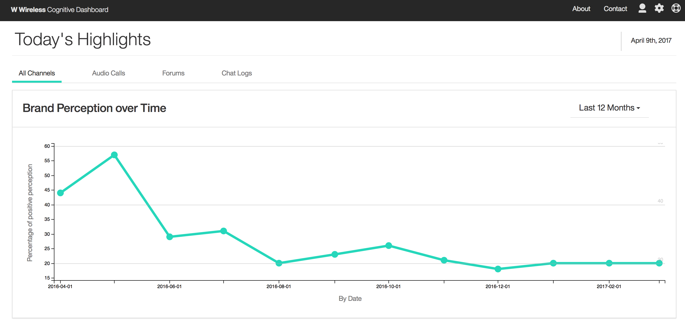
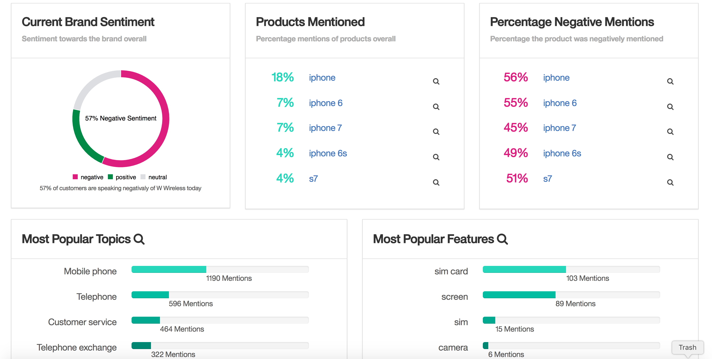
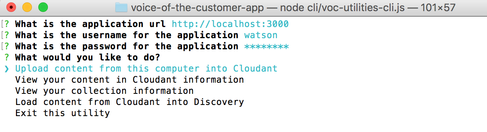

# Voice of the Customer Accelerator

## Overview

This Watson Accelerator demonstrates how communication with customers can be analyzed by Watson to provide a high level view of the sentiment towards products, services and brand.  This information can be used for
proactive responses to customer demands, issue resolution, and training and allocation of staff.





# Description

This Accelerator requires Watson Discovery Service (WDS), Cloudant NoSQL DB and Watson Knowledge Studio (WKS) to do your own annotations on the content.  These annotations would then become the entity extraction values in the enrichment.

The Accelerator provides you with the ability to load your own content into WDS.

This Accelerator does not limit you in how to obtain the content, but it does require it to be JSON and some specific fields to exist in the content when it is loaded into WDS.  Please keep in mind that the WKS model which is part of this Accelerator is trained on telco products and will annotate as such.  If you want to train your own WKS model, it is required that a `product` entity type is annotated.

The high-level steps to get this application running is as follows;

1. Collect some content or use the sample content provided.
2. Load the content into the Cloudant database using the provided utility.
3. Load the content into WDS using the provided utility.

You can also use the Crawler that comes with Discovery to load the content into WDS.


# Required Services

This Accelerator requires 2 services to be created as well as WKS 2.0 for training your model.  You can reuse services by binding existing services to this application.

- IBM Cloudant NoSql Database
- Watson Discovery Service (WDS)
- Watson Knowledge Studio (WKS)

# Setup Instructions


The setup is done in 4 primary steps.  You will download the code, configure the code and then deploy the code to Bluemix.  Once you have deployed the code to Bluemix, you will load the data into Cloudant and then trigger a task to load the content from Cloudant into Discovery.

If you would like to run the code locally, there will be one more step to configure the credentials locally.

> Think of a name for your application.  The name must be unique within Bluemix, otherwise it won't deploy.  This name will be used in a number of steps to get the application up and running.

## Setting up Bluemix

[](https://bluemix.net/deploy?repository=https://github.com/IBM/voice-of-the-customer)

1. If you do not already have a Bluemix account, [sign up here](https://console.ng.bluemix.net/registration).
2. Log into Bluemix with your own credentials.
3. Create a new application by clicking on the Create App button on the Bluemix Dashboard.
4. On the left navigation, select Cloud Foundry Apps.
5. Click on the SDK for Node.js option on the right.
6. Enter your unique application name you though of before and click the Create button.
7. Wait until the application is started and available.
8. From the Bluemix Dashboard, select the newly created application.
9. Select Connections on the left.

### Create the following services using the procedure below

  - `Cloudant NoSql Database`
  - `Watson Discovery Service`

1. Click on the Connect new button.
2. Search for the service you would like to create.
3. Create the service using the free, light or standard plans.
4. Bind it to your application.
5. Re-stage the application.

### Create the Discovery environment.

1. In the application details page, select the Connections option on the left.
2. Click on the Discovery tile.
3. Select the `Service Credentials` tab.
4. Click on the New credentials button.
5. Click the Add button on the popup.  No other information is needed.
6. Select the `Manage` tab.
7. Click the Launch tool.
8. In the Discovery Dashboard, click Create a data collection tile.
9. If asked, setup the storage.
10. Create a new Collection.  You can name it anything you want as the app reference it with the id.  Use the Default Configuration.

### Setup and train WKS

You can get access to a free trial version of WKS [here](https://www.ibm.com/us-en/marketplace/supervised-machine-learning).

To upload your model, follow these steps:

1. Create a new project in Watson Knowledge Studio.
2. Upload the type system, dictionaries, and documents in that order.  Files can be found in the accelerator/wks folder.
3. Go to your annotator components and click Create a Machine Learning Annotator.
4. Click “All” under document sets and click “Next.”
5. Map dictionaries to the appropriate entities.
6. Now click “Train and Evaluate” the annotator. This should take ~15 minutes and when it is done you can deploy to WDS.
7. The instructions for deploying from WKS are here: https://www.ibm.com/watson/developercloud/doc/wks/publish-ml.html#wks_madiscovery
8. The instructions for using the deployed model are here: https://www.ibm.com/watson/developercloud/doc/discovery/integrate-wks.html
9. IMPORTANT: for step 8 use the following curl command instead of the one in the documentation
curl -X PUT -u "{username}":"{password}" -H "Content-Type: application/json" -d@my_config.json "https://gateway.watsonplatform.net/discovery/api/v1/environments/{environment_id}/configurations/{configuration_id}?version=2016-12-01"

## Configure the code

1. Clone the app to your local environment from your terminal using the following command:
  `
  git clone https://github.ibm.com/Watson-Solutions-Lab/voice-of-the-customer-app.git
  `
2. `cd` into this newly created directory
3. Edit the manifest.yml file and replace the name and host values ```voice-of-the-customer-app``` with our own unique name you came up with.
4. Save the manifest.yml file.
5. Edit the package.json file and modify the application name as well.

### Configuration files

There are 2 sample configuration files that are required by the application.

The `env-vars-example.json` file should be copied to `env-vars.json` before the application is executed locally or on Bluemix.

The `vcap-local-example.json` file should be copied to `vcap-local.json` before the application is executed locally.  This file contains your service credentials required to run the application locally.  If the app is run on Bluemix, the app will use the VCAP service information on Bluemix.  The sample file is a skeleton of what is required, but, you have to fill in the details.

### Update the Discovery information

It is required to update the `env-vars.json` file with the newly created collection information.  On the Collection Dashboard, copy and paste the Collection Id, Config Id and Environment Id into the `env-vars.json` file in the variables shown below.

```
"DISCOVERY_ENV_ID": "",
"DISCOVERY_COLLECTION_ID": "",
"DISCOVERY_CONFIG_ID": ""
```

### Build Prerequisites

The application requires the following software to be installed locally.

1. Node (6.9+) Application runtime environment
2. NPM (3.10+) Server side dependency management
3. Gulp (3.9+) `npm install -g gulp`
4. Angular CLI (1.0.0) `npm install -g @angular/cli`

> If you have Angular CLI already installed.  Please read the upgrade instructions for Angular CLI when you upgrade the software.

### Installing the dependencies

The server dependencies are controlled and defined in [the main package.json](./package.json).

The client dependencies are controlled and defined in [the client package.json](./client/package.json).

To install all required dependencies to both build the application and execute the application, execute the following script from the project root.

Linux/Unix/MacOs

```
sh ./install.sh
```
or Windows

```
./install.bat
```

Alternatively, the dependencies can be installed manually with the following commands from project root

```
npm install
(cd client/ && npm install)
```

### Building the application

>For the application to run on Bluemix or locally, it needs to be built first.

To do that, the Prerequisites needs to be met and install must have been executed successfully.

From the App folder, run the command `gulp build`.

This will build the code into a folder called dist that will contain 3 sub-folders.  If any error occurred, then the build wasn't successful and is probably a dependency issue or install that wasn't ran or successful.

## Running the app on Bluemix

1. Open the `manifest.yml` file and change the `name` and `host` values to your application name.  The host you choose will determinate the subdomain of your application's URL:  `<host>.mybluemix.net`

2. Connect to Bluemix in the command line tool and follow the prompts to log in

  ```
  $ cf login -a https://api.ng.bluemix.net
  ```
3. Push the app to Bluemix, but don't start it yet.  We would need to bind the services to the new application before starting it up.

  ```
  $ cf push
  ```

4. The application should now be running on Bluemix.  You can access the application URL using the application name you defined in the manifest.yml file with a '.mybluemix.net' appended to it.

5. The application is secured with a username and password.  By default the credentials are username = watson and password = p@ssw0rd.

6. Continue to the next step to do some additional configuration within the application.

## Loading the data

This Accelerator comes with some sample data that can be loaded into Discovery.  You have 2 choices, you can either use the utilities that are part of this Accelerator to load the data, or you can use the [data crawler](https://www.ibm.com/watson/developercloud/doc/discovery/data-crawler.html).
>Note: There would be some additional steps to split the data up before you crawl it with the data crawler.

### Content Preparation

This Accelerator comes with some sample data.  If you would like to use your own data keep reading.

As with all Cognitive solutions, the preparation of the content for Watson is the most important part of the development process.

This Accelerator required that the content is prepared in a certain format before it is loaded into WDS.  This
Accelerator accepts JSON that is on your local file system.

The content needs to be within the customer communication domain.  Examples of this would be forums where customers post questions or complaints, product reviews or call center interactions.

There are 2 fields required in the content to make this application function.

1. text - The content of the customer statement.  This should be something where the customer states the problem or review the product.
2. contact_date - The date when the customer made the statement.  Should be in ISO format YYYY-MM-DDTHH:MM:SSZ.

### Loading the data into Cloudant

Loading the data into Cloudant will provide you with the ability to re-start loading content into Discovery.

The utility to load the data into Cloudant runs on your local machine, sends the data to the application, running on Bluemix, and loads the data into Cloudant.  This means that the application must be deployed to Bluemix before you can attempt this step.

From the application folder.  Enter the following command to enter the Utility CLI.

`node cli/voc-utilities-cli.js`



1. Enter the Bluemix url for your application.
2. Enter the username (watson) and password (p@ssw0rd).
3. Select the option to `Upload content from this computer into Cloudant`.
4. Enter the folder `./accelerator/data`.
5. Data will be sent, in bulk, to the application and load it into Cloudant.
6. When done, the menu will be displayed again.  Continue on to the next step.

### Trigger the Task to load the content into Discovery

You can view the number of documents in Cloudant, broken down in those that are loaded into Discovery and those that are not.  When you run the Discovery load task, only the documents not yet loaded will be loaded into Discovery.

1. From the CLI menu select the option to Trigger the task to `Load content from Cloudant into Discovery`.
2. Once the task is triggered, you can view the status by selecting the Collection Info option from the menu.  Here you will see the number of documents loaded (and those that failed) in your Discovery Collection.
3. Once all 1000 sample documents are loaded, the application is ready for use.  Enter the Bluemix url in your Browser to log into the application.

## Running the app locally

To run the application locally (your own computer), you have to install additional Node.js modules and configure the application with some credentials that is provisioned on Bluemix.

### Starting the application

There are a few quick steps required to stand up the application. In general, the required tasks are.

1. Install the server and client dependencies
2. Commission the required services
3. Configure the environment variables in manifest.yml (cloud deployment) or .env (local deployment)
4. Build and run or deploy

## The Local VCAP file

The vcap-local.json file consist of your Bluemix service credentials when you run the application locally.

This file must be updated with your service credentials before the application can be executed.

1. On the Bluemix Application page, select the Connections option on the left.
2. Select each of the services you provisioned earlier and view the credentials.
3. Copy the credentials using the 'copy' icon.
4. Edit the vcap-local.json file.
5. Paste the content of the clipboard into the vcap.local file.
6. The structure of this file consist of a service name and a json object, but the pasted value is wrapped in another ```{ }``` that should be removed.
7. A sample of what it should look like below;

```
{
  "cloudantNoSQLDB": [
    {
      "credentials": {
        ...
      },
      "syslog_drain_url": null,
      "label": "cloudantNoSQLDB",
      "provider": null,
      "plan": "Lite",
      "name": "Cloudant NoSQL DB-xx",
      "tags": [
        "data_management",
        "ibm_created",
        "ibm_dedicated_public"
      ]
    }
  ],
  "discovery": [
    {
      ...
    }
  ]
}
```

8. Once all the credentials are in place, the application can be starter with `gulp develop`.

## Accessing the Application

There is only 1 user required for this application.  This user is `watson` with a password of `p@ssw0rd`

The user names and passwords can be modified in the /server/boot/init-access.js file.

# Privacy Notice

The following information is sent to a [Deployment Tracker](https://github.com/IBM-Bluemix/cf-deployment-tracker-service) service on each deployment:

* Node.js package version
* Node.js repository URL
* Application Name (`application_name`)
* Application GUID (`application_id`)
* Application instance index number (`instance_index`)
* Space ID (`space_id`)
* Application Version (`application_version`)
* Application URIs (`application_uris`)
* Labels of bound services
* Number of instances for each bound service and associated plan information

This data is collected from the `package.json` file in the sample application and the `VCAP_APPLICATION` and `VCAP_SERVICES` environment variables in IBM Bluemix and other Cloud Foundry platforms. This data is used by IBM to track metrics around deployments of sample applications to IBM Bluemix to measure the usefulness of our examples, so that we can continuously improve the content we offer to you. Only deployments of sample applications that include code to ping the Deployment Tracker service will be tracked.

## Disabling Deployment Tracking

To disable tracking, simply remove ``require("cf-deployment-tracker-client").track();`` from the ``server.js`` file in the server directory.

